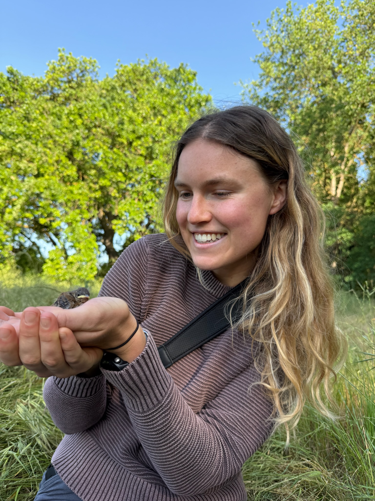
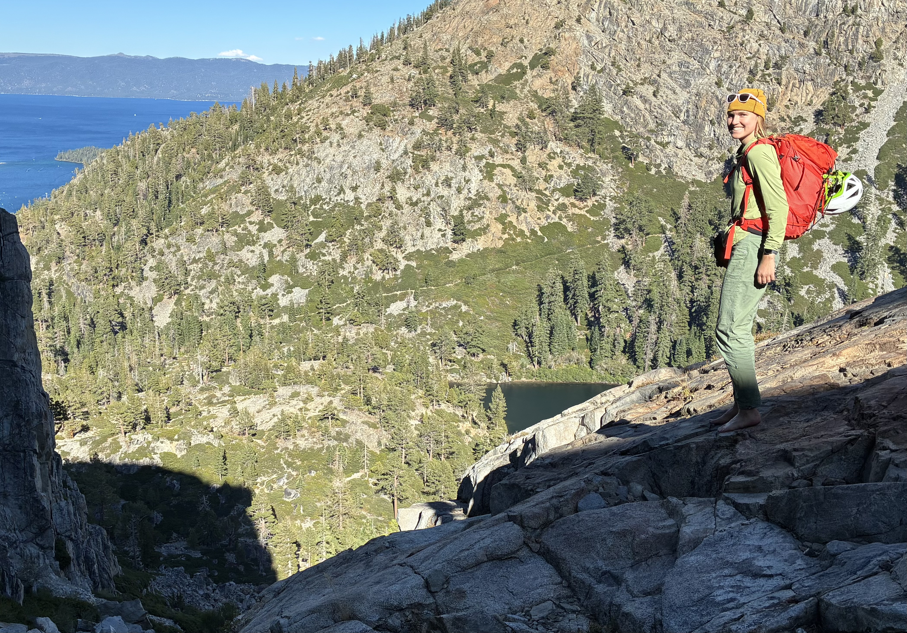

::: page-head
# About
:::

::: sidecol
{width="300"
style="float:right; margin:5px 0 18px 28px;"}

{width="300"
style="float:right; margin:5px 0 18px 28px;"}
:::

::: sub
I was born and raised in Los Angeles, CA.

In my free time I enjoy trail running, rock climbing, mountaineering,
birding, cooking, reading, and mushroom foraging.

I often post my adventures on [mountain
project](https://www.mountainproject.com/user/201616309/clara-thomas),
[beak bagger](https://peakbagger.com/climber/climber.aspx?cid=60327),
and [strava](https://www.strava.com/athletes/70894240), and cool
critters, fungi, plants and such on
[iNaturalist](https://www.inaturalist.org/people/clarathomas) and
[eBird](https://ebird.org/profile/MzA1MTkxNQ).

**Currently:**

M.S. student, Odom Lab

University of the Pacific, Stockton, CA

Department of biological sciences

**Undergraduate:**

Cornell University, Ithaca, NY

B.A. in Environment & Sustainability, concentration in Evolutionary
Biology and Applied Ecology
:::

```{=html}
```

## Contact

:::: contact
::: contact
c_thomas25 \[at\] u.pacific.edu
:::
::::
