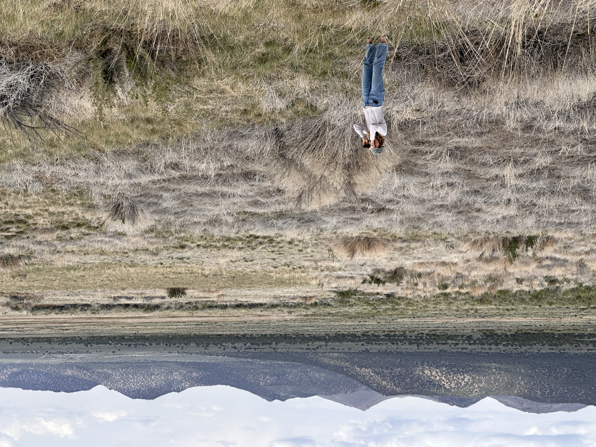

{width="400"
style="float:right; margin:5px 0 18px 28px;"}

::: lede
Hello! I am a master’s student in the [Odom
Lab](https://www.karanodom.com/) at the University of the Pacific.

I use quantitative methods from bioacoustics, ecology, statistics, and
data science to study and help prevent biodiversity loss through habitat
conservation.

My current research uses autonomous acoustic recorders and machine
learning to survey bird communities in California’s rapidly urbanizing
Central Valley.

Before joining the Odom Lab, I received a B.A. in Evolutionary Biology
and Applied Ecology from Cornell University.
:::

## Contact

::: contact
c_thomas25 \[at\] u.pacific.edu
:::
