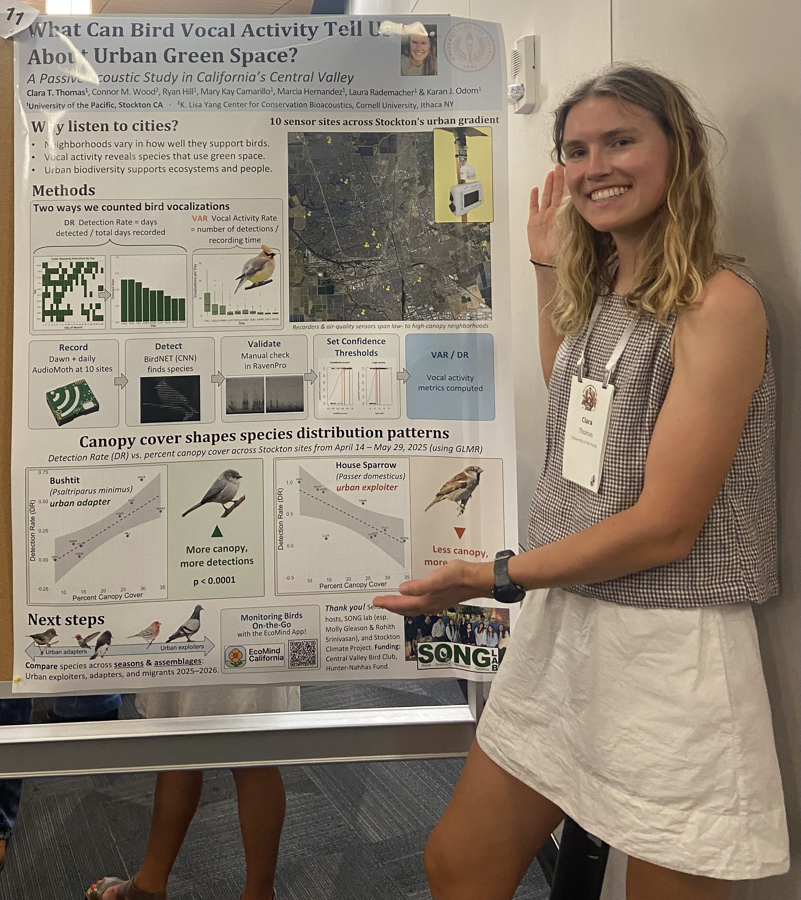

:::::::::: page-head
# Research
::: sub
**Quantitative ecology · Conservation bioacoustics · Ornithology**

## **Passive acoustic monitoring of urban bird communities.**
:::

Urban areas are expanding rapidly worldwide and pose a growing threat to
biodiversity, especially in regions already heavily modified by human
land use. One of North America's most altered landscapes is California’s
Central Valley, which has lost the majority of its historic wetlands,
riparian forests, and grasslands, leading to widespread declines of
habitat-specialist birds.

The Central Valley forms a large part of the Pacific Flyway bird
migration route, thus protecting quality habitat is very important for
sustaining migratory and overwintering species. However, we still have a
lot to learn about how different functional groups of birds are
responding to human development in this region.

My research addresses this gap by monitoring bird species occupancy
across an urban gradient in Stockton, California. I am using passive
acoustic monitoring and machine learning-based species identification to
assess patterns in bird species richness and occupancy in relation to
vegetation structure and urban land use to inform citywide greening
initiatives.

## Presentations

{width="300"
style="float:right; margin:5px 0 18px 28px;"}

::::: pubs
::: pub
[What can bird vocal activity tell us about urban green space? A passive
acoustic study in California's Central Valley]{.title} [American
Ornithological Society, Amherst, MA — August 2026 (poster)]{.cite}
:::

::: pub
[Using automated acoustic monitoring to evaluate avian biodiversity in a
structurally diverse urban landscape]{.title} [Animal Behavior Society,
Baltimore, MD — July 2025 (poster) · Central Valley Birding Symposium,
Stockton, CA — November 2025 (talk)]{.cite}
:::
:::::

## Funding

::::: pubs
::: pub
[Central Valley Bird Club Research Grant Award]{.title} [May 2026 — two
months support]{.cite}
:::

::: pub
[Hunter-Nahhas Fellowship Award]{.title} [University of the Pacific,
Department of Biological Sciences, May 2025 — three months
support]{.cite}
:::
:::::
::::::::::
